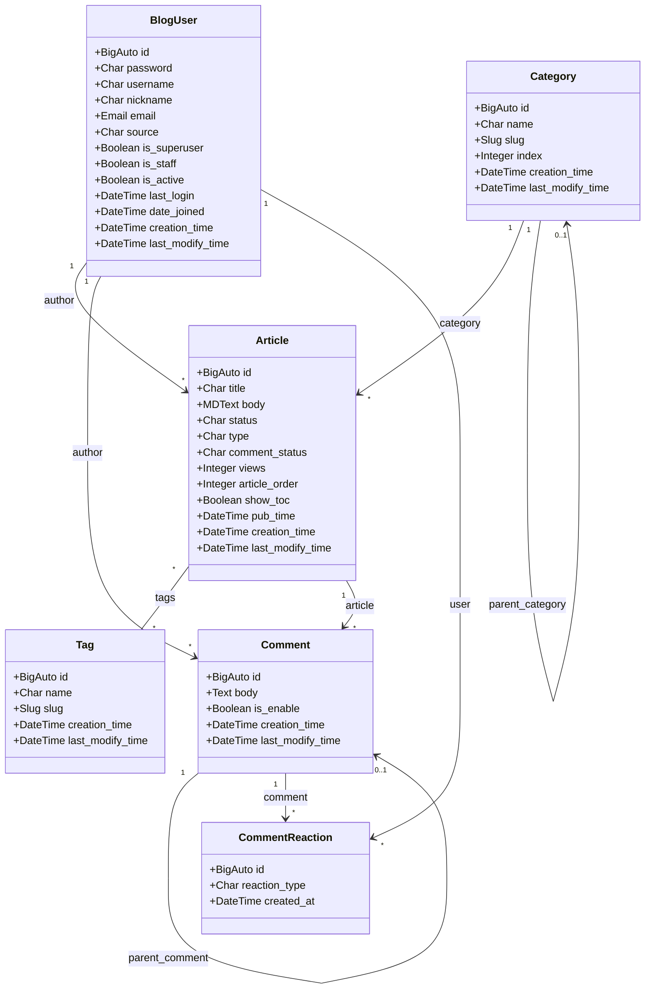
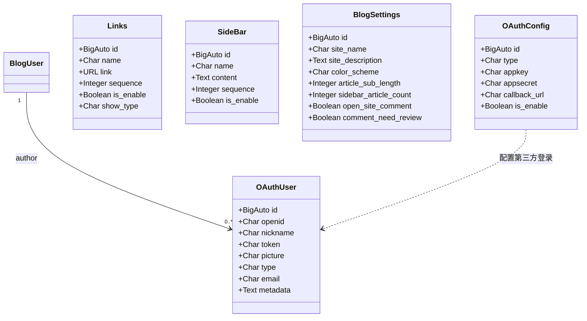

# 数据模型与类图

> 本文档对应课程第 4 周任务：「分析项目的数据库和 model，通过类图建模系统的数据模型」。
>
> **生成方式**：由脚本遍历 Django 的 `apps.get_app_configs()` / `Model._meta.get_fields()` 自动提取，
> 反映的是**代码中 model 的定义**。建议与 MySQL 中实际的表结构（`SHOW CREATE TABLE`）对照核验后再定稿。
>
> 提取时间：2026-09-12

## 一、总览

项目共 **5 个业务 app**、**13 个模型**（不含 Django 内置的 auth/admin 等）：

| app | 模型数 | 模型 |
|---|---|---|
| `blog` | 6 | `Article`、`Category`、`Tag`、`Links`、`SideBar`、`BlogSettings` |
| `accounts` | 1 | `BlogUser` |
| `comments` | 2 | `Comment`、`CommentReaction` |
| `oauth` | 2 | `OAuthUser`、`OAuthConfig` |
| `servermanager` | 2 | `commands`、`EmailSendLog` |

**核心是 5 个实体**：`BlogUser`（用户）、`Article`（文章）、`Category`（分类）、`Tag`（标签）、`Comment`（评论）。
其余模型多为配置项或辅助功能。

## 二、核心业务模型类图

## 三、辅助模型

## 四、关系说明

### 4.1 一对多（ForeignKey）

| 关系 | 说明 |
|---|---|
| `BlogUser` → `Article` | 一篇文章有一个作者；一个作者可写多篇文章 |
| `BlogUser` → `Comment` | 一条评论有一个作者 |
| `BlogUser` → `CommentReaction` | 用户对评论的点赞/表态记录 |
| `Category` → `Article` | 一篇文章属于一个分类 |
| `Article` → `Comment` | 一篇文章可有多条评论 |

### 4.2 多对多（ManyToMany）

| 关系 | 说明 |
|---|---|
| `Article` ↔ `Tag` | 一篇文章可打多个标签，一个标签可属于多篇文章 |

### 4.3 自关联（Self-referential）

| 关系 | 说明 |
|---|---|
| `Category.parent_category` → `Category` | **支持多级分类**：分类可以有自己的父分类，形成树状结构 |
| `Comment.parent_comment` → `Comment` | **支持楼中楼**：评论可回复另一条评论，形成嵌套 |

> 这两个自关联是设计上值得注意的地方——它们让"分类树"和"评论树"无需额外表即可实现。

### 4.4 其他设计特点

- **抽象基类 `BaseModel`**（`blog/models.py:29`，`abstract = True`）：统一提供 `creation_time` / `last_modify_time` 两个时间字段。`Article`、`Category`、`Tag` 均继承它——这是 Django 中复用公共字段的标准做法（抽象基类不会生成独立的表）
- **外键级联行为**：所有 `ForeignKey` 均为 `on_delete=models.CASCADE`，即**父记录删除时子记录一并删除**。例如删除一个用户，其名下的文章和评论都会被连带删除
- **`BlogSettings` 是单例**：站点级配置（站点名、配色、评论开关等）全部集中在一个模型里，通过 `get_or_create` 保证只有一条记录
- **`BlogUser` 继承 `AbstractUser`**：在 Django 内置用户模型基础上扩展了 `nickname`、`source` 等字段，并通过 `AUTH_USER_MODEL = 'accounts.BlogUser'` 替换默认用户模型（`djangoblog/settings.py:272`）

## 五、数据库表名对照

Django 默认的表名规则是 `<app名>_<模型名小写>`：

| 模型 | 实际表名 |
|---|---|
| `Article` | `blog_article` |
| `Category` | `blog_category` |
| `Tag` | `blog_tag` |
| `Links` | `blog_links` |
| `SideBar` | `blog_sidebar` |
| `BlogSettings` | `blog_blogsettings` |
| `BlogUser` | `accounts_bloguser` |
| `Comment` | `comments_comment` |
| `CommentReaction` | `comments_commentreaction` |
| `OAuthUser` | `oauth_oauthuser` |
| `OAuthConfig` | `oauth_oauthconfig` |
| `commands` | `servermanager_commands` |
| `EmailSendLog` | `servermanager_emailsendlog` |

## 六、待补充

- [ ] 与 MySQL 实际表结构逐字段对照（`SHOW CREATE TABLE blog_article;` 等），确认 model 与库一致
- [ ] 补充字段的中文含义说明
- [ ] 标注索引、唯一约束、外键的级联行为（`on_delete`）
- [ ] 按课程要求补充**代码标注**
